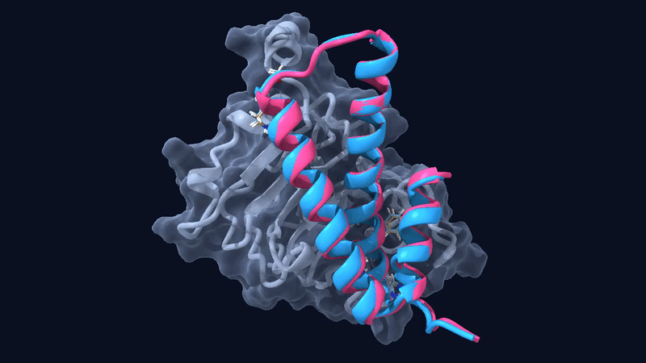

# My first protein design: a conditional EGFR binder


Entry for **Challenge 1** of the Anthropic × Adaptyv Protein Design Competition (Proteinbase): design a binder to the extracellular region of EGFR that

1. binds human EGFR,
2. also binds mouse EGFR, and
3. binds at pH 6.5 (tumour microenvironment) but not at pH 7.4 (healthy tissue).

This was my first protein design project. This repository records what I did, what worked, what broke, and what I would change. **None of the designs has been tested yet; results will be published by the organisers on Proteinbase.**

> Status: Status: submitted to Challenge 1 on Proteinbase; designs have not been tested. Everything below is computational prediction or hypothesis.

## Result at a glance

| Rank | Name | Description | His | BindCraft i_pTM | i_pAE |
|---|---|---|---|---|---|
| 1 | egfr_c1_01 | mpnn3, accepted by BindCraft | 1 | 0.85 | 0.17 |
| 2 | egfr_c1_02 | mpnn3 R11H | 2 | not computed | |
| 3 | egfr_c1_03 | mpnn3 R11H K40H | 3 | not computed | |
| 4 | egfr_c1_04 | mpnn3 K40H | 2 | not computed | |
| 5 | egfr_c1_05 | mpnn3 Y14H | 2 | not computed | |
| 6 | egfr_c1_06 | mpnn3 S38H | 2 | not computed | |
| 7 | egfr_c1_07 | mpnn3 R11H Y14H K40H | 4 | not computed | |
| 8 | egfr_c1_08 | mpnn1, accepted by BindCraft | 1 | 0.84 | 0.17 |
| 9 | egfr_c1_09 | mpnn9, scored but not accepted | 3 | 0.59 | 0.35 |

All designs are 76 amino acids. Sequences: [`data/submission_upload.csv`](data/submission_upload.csv).

## Pipeline

```
EGFR extracellular region (human P00533, mouse Q01279)
        |
        v
PDB 6ARU chain A  ->  trim to domain III (mature 310-480)
        |
        v
EGFR residues within 4 A of the cetuximab Fab  ->  keep ones identical in mouse
        |                                          (hotspots 408, 409, 412, 465, 469)
        v
BindCraft (AlphaFold2 + ProteinMPNN + PyRosetta), lengths 60-80, Relaxed filters
        |
        v
2 accepted designs (mpnn3, mpnn1)
        |
        v
Interface analysis: binder residues near EGFR Asp/Glu
        |
        v
Histidine substitutions (6 variants of mpnn3)  ->  ranked CSV  ->  Proteinbase
```

## Why this problem is hard

Structure predictors do not take pH as an input. The same complex folds identically at pH 6.5 and 7.4, so the main objective has no direct signal during generation. My workaround was a heuristic: histidine is mostly protonated at pH 6.5 and mostly neutral at 7.4, so a histidine paired with an EGFR Asp/Glu may form a contact that weakens at neutral pH. Arg and Lys stay charged at both pH values, so swapping them for His could make a contact pH dependent.

This is a hypothesis, not a validated mechanism.

## Steps (reproducing this)

1. **Sequences.** Human and mouse sequences are in [`data/egfr_targets.fasta`](data/egfr_targets.fasta) (taken from the competition page). Mature numbering = position in that sequence; UniProt number = mature + 24.
2. **Find hotspots.** In Colab, run `scripts/step1_contacts.py` (needs `biopython`). It downloads 6ARU, lists chain A residues in contact with the Fab, maps them to mature numbering, flags human/mouse differences, and writes a domain III PDB.
3. **Run BindCraft.** Open the BindCraft Colab notebook from <https://github.com/martinpacesa/BindCraft>. Settings: chain `A`, hotspots `408,409,412,465,469`, lengths `60-80`, 2 final designs, filter option `Relaxed`. With a recent JAX I needed two patches, in [`scripts/colab_patches.py`](scripts/colab_patches.py).
4. **Inspect the accepted designs.** `scripts/interface_residues.py` lists EGFR residues touching the binder (with a human/mouse check) and binder residues near EGFR Asp/Glu.
5. **Make histidine variants.** `scripts/make_his_variants.py`.
6. **Validate the submission CSV.** `scripts/validate_submission.py data/submission_upload.csv`.
7. **Upload** to Proteinbase with the methods text in [`docs/methods.md`](docs/methods.md).

## Problems I hit (and fixes)

| Problem | Cause | Fix |
|---|---|---|
| `nvidia-smi: command not found` | Colab session had no GPU | Runtime > Change runtime type > GPU |
| `jax.lib has no attribute 'xla_bridge'` | Newer JAX removed it | Patch 1 in `colab_patches.py` |
| `clip() got an unexpected keyword argument 'a_max'` | JAX renamed arguments | Patch 2 in `colab_patches.py` |
| `NameError: advanced_settings_path` | Restarting the session cleared notebook variables | Rerun the settings cells in order; do not restart after patching |
| "0 designs" in my stats check | My script read the stats file of an older run folder | Read the specific run folder, not the first glob match |

## Limitations

- No pH selectivity was predicted; no folding model here sees pH.
- The histidine variants were **not refolded or scored**.
- No mouse cross-reactivity prediction was done.
- Residue numbering in BindCraft's output was inferred (renumbered from 1), not independently verified.
- A distance cutoff does not show whether an EGFR carboxylate is partly buried, which a pKa shift needs.
- mpnn3 and mpnn1 come from one trajectory (74% identical), so the set is less diverse than nine designs suggests.

## What I would do next

- Refold every variant against human and mouse domain III (ColabFold) and drop the ones that lose the complex.
- Run BindCraft longer for more independent backbones.
- Pick the epitope for conserved, acidic, partly buried carboxylates instead of copying the cetuximab site.
- Check pKa predictions with a tool and treat them cautiously: tools like PROPKA are parameterised on natural proteins.

## Repository layout

```
data/        sequences, submission CSVs
scripts/     analysis and helper scripts
docs/        methods text submitted to the competition
structures/  put accepted design PDB files here
media/       put the movie / animation here
```

## Credits and links

- Competition: Anthropic × Adaptyv Protein Design Competition on Proteinbase, <https://proteinbase.com/competitions/anthropic-adaptyv-2026/submit>
- BindCraft (Pacesa et al.): <https://github.com/martinpacesa/BindCraft>. Not included here; it uses PyRosetta, which has its own licence terms.
- ColabFold: <https://github.com/sokrypton/ColabFold>
- Target structure: PDB 6ARU (EGFR extracellular region with cetuximab Fab mutant)

Scripts are MIT licensed. The competition states that submitted designs and results are released publicly on Proteinbase (ODC-BY).
